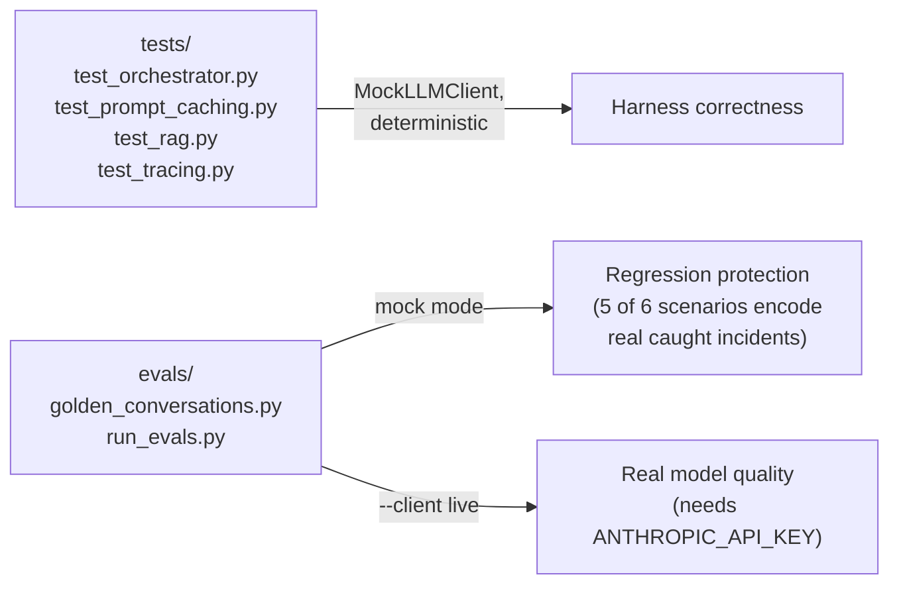

# ANITA — Comprehensive Project Documentation

**A**daptive **N**avigation & **I**tinerary **T**ravel **A**ssistant

A conversational AI travel planning assistant that builds a rich, 21-category traveller profile through natural conversation, infers hidden preference signals rather than asking for them directly, and hands off to a grounded Recommendation Engine for destination, flight, hotel, itinerary, activity, restaurant, packing, budget, and risk output.

---

## 1. Project Problem Statement

Existing AI travel planning tools — both general-purpose assistants (ChatGPT, Claude, Gemini, Perplexity) and dedicated trip planners (Stippl, Layla, Stardrift, MindTrip, Wanderlog, GuideGeek, Navan Edge) — reliably produce itineraries fast, but share three specific, well-documented weaknesses:

1. **Recommendations are presented as flat fact, with no signal of how reliable they are.** Every reviewed tool returns a suggestion the same way whether it's well-supported or a guess, forcing the traveler to manually verify everything before trusting it. Independent multi-tool comparisons have found current planners "get you 80% of the way there, then hand you a mess of loose ends" — outdated hours, closed venues, and outright fabrications requiring manual correction.
2. **Memory is shallow and short-lived.** Even tools praised for "preference memory" typically carry forward one or two explicitly stated preferences (e.g. "boutique hotels, not resorts") rather than maintaining a genuinely multi-dimensional profile that updates from behavior across sessions and trips.
3. **Complex, real-world trip logistics still break most tools.** Multi-traveler tests (mixed ages, accessibility needs, budget tradeoffs across a group) find most tools fail to coordinate this at all — the simple single-traveler prompts most reviews use don't surface this, but real travel planning routinely involves exactly this kind of complexity.

**The underlying problem, stated simply:** travelers can get an itinerary quickly, but they can't tell what to trust in it, and the tool doesn't get better at helping them personally over time.

ANITA targets this directly through three architectural commitments, not a general claim of being "smarter": grounded recommendations with explicit unreliability signaling rather than confident-sounding guesses, a traveller data model deliberately designed for durable cross-trip memory, and a 21-category profile purpose-built to handle multi-traveler, accessibility, and budget-constrained complexity rather than the single-traveler happy path most tools optimize for. Section 2 below maps each of these against what the market currently does, and Section 3's Phase breakdown is honest about which of these three commitments are actually delivered today versus architecturally designed but not yet built.

---

## 2. Research: Existing Solutions and Their Limitations

### 2.1 Landscape survey

**General-purpose chatbots used for travel**

| Tool | Strengths | Key limitations |
|---|---|---|
| ChatGPT | Conversational itinerary building, cultural/etiquette context, Agent Mode can research and assist with booking on paid plans | Can't check live flight prices or hotel availability reliably; no shareable/editable structured itinerary; doesn't retain preferences across sessions |
| Google Gemini | Native access to Google Maps/Flights/Hotels/Gmail — real flight data, hotel availability, can parse existing bookings from inbox | Weak structured, shareable itinerary output; preference memory is shallow |
| Claude | Strong for complex, nuanced planning and drafting detailed itineraries or summarizing visa documents | Not purpose-built for travel; no live pricing/availability grounding, no persistent traveller profile |
| Perplexity | Best-in-class for fact-checking travel requirements (visa rules, currency) with cited sources | Not an itinerary-building tool; no persistent profile or booking integration |

**Dedicated AI travel planners**

| Tool | Strengths | Key limitations |
|---|---|---|
| Stippl | Full day-by-day itinerary generation, drag-and-drop editing, automatic per-person budget splits, packing list, live group sharing | Preference handling stays surface-level; no real extraction/hard-constraint layer |
| Layla | Live pricing via Skyscanner/Booking.com, "PriceLock" drop alerts, video-based inspiration | Preference memory limited; itineraries can thin out past ~day 8 (a documented failure mode across the category) |
| Stardrift | Explicit preference learning (no red-eyes, preferred airline, calendar constraints); bookable flights/hotels with current pricing; business-travel mode | The one tool market reviews specifically praise for "remembering" rather than "searching harder" — but even this is a handful of explicit rules, not a multi-dimensional inferred profile |
| MindTrip | Collaborative planning, shared itineraries, group chat, can build from a social link/screenshot | Surface-level preference capture; no real hard-constraint extraction |
| Wanderlog | Strong map-based group organization | Free tier capped at 5 AI messages per trip; preference memory minimal |
| GuideGeek | Lives inside WhatsApp/Instagram/Messenger, no app needed, 50+ languages, real-time local answers | No persistent profile, no structured multi-day itinerary building |
| Navan Edge | Business-travel focused, single-chat booking, human-agent backup, confirms before any change/cancellation | Narrow business-travel scope; not a general leisure-trip tool |

### 2.2 Common weaknesses across the category

- **Hallucinated or stale details** — restaurants that no longer exist, seasonal routes shown as year-round, pricing stale by days. The single most commonly cited complaint across independent reviews.
- **Shallow, short-lived memory** — "preference memory" in practice means one or two explicitly stated rules, not a profile that infers and updates from behavior.
- **Breaks under real-world complexity** — multi-traveler, mixed-accessibility-need, cross-person-budget trips are where most tools fail, even though this is closer to how people actually travel than the single-traveler prompts most comparisons test with.

### 2.3 How ANITA maps against these gaps — honest status, not aspiration

| Market gap | ANITA's architectural answer | Actually delivered today? |
|---|---|---|
| Flat, unsignaled fabrication risk | RAG grounding (curated corpus + live Google Places) for activities/location instead of relying on the model's own knowledge; explicit `grounded: False` flagging on every sub-engine pending a live data source; two real fabrication incidents caught live and closed structurally (see Section 7's incident log) | **Partially.** Activities and location are genuinely grounded. Flights, hotels, restaurants, and pricing are still stubs — the gap this project targets is not yet closed for those categories. |
| Shallow, short-lived memory | Two-tier schema (`traveller_identity` persists across trips vs. per-trip fields) plus 15 continuously-inferred AI-derived preference scores — deliberately designed to be a genuinely multi-dimensional, behavior-inferred profile, not a handful of explicit rules | **Not yet.** The schema is built for this; actual cross-session persistence is explicitly deferred (see `docs/decisions/0001-traveller-profile-persistence.md`). This is currently ANITA's biggest gap between architectural intent and delivered reality. |
| Breaks under multi-traveler/accessibility/budget complexity | 21-category profile including `traveller_composition.members` (per-person name/age/relation/senior-citizen), hard-constraint filtering (accessibility, allergies) applied *before* any LLM ranking in every sub-engine, family-form UX purpose-built for group trips | **Yes.** This is ANITA's most concretely delivered differentiator today — verified working end-to-end in live testing with a real multi-generational family trip (adult, senior citizen with mobility constraints, child). |

**Honest framing for this capstone:** of the three gaps this project set out to close, multi-traveler/accessibility complexity handling is genuinely delivered and tested; grounding is real but partial (one category done well, several still stubbed); durable cross-session memory is architecturally ready but not yet built. Group budget tracking, packing-list depth, and calendar sync are treated as explicitly out of scope for this capstone rather than overlooked gaps.

---

## 3. Project Phases

### Phase 1 — MVP (demo-night deliverable)

Scope: a fully functional, demoable conversational trip-planning flow, built and hardened under a hard deadline.

- Chat Assistant with a 21-category traveller profile schema, ask-vs-infer elicitation strategy, and AI-derived preference scoring
- Structured output via forced tool-calling (`record_turn`), not prompt-only JSON — fixed a live reliability bug where the model occasionally replied in prose instead of structured data
- Google Places API integration for the map exploration flow (destination geocoding + nearby POI search), with a static-centroid fallback when live data isn't available
- Client-side/LLM-side interaction boundary: map pin-dragging and family-member form editing never round-trip through the LLM; only meaningful decisions (explicit lock-in, form save) do
- Graceful degradation: `ResilientLLMClient` falls back to a safe scripted response on any live API failure, so a transient network/rate-limit issue never crashes the conversation
- Recommendation Engine scaffold: 9 sub-engines with correct guardrail *structure* (hard-constraint filtering, grounded-vs-mock flagging, budget-as-ceiling) — most still stubs at this phase
- State-injection fix: the model is given the *actual* current profile state as grounded JSON every turn, not just its own past reply text — this was the root cause of most "I told it that already" and fabrication symptoms, and fixing it materially improved reliability
- Two real fabrication incidents caught live and fixed with a consistent pattern (prompt guardrail *and* structural write-protection): the model inventing family member names/ages, and later the model self-reporting a locked map location that was never actually confirmed through the UI
- Auto-continue pattern: client-side actions (map lock-in, family form save) that don't naturally involve the LLM still trigger a synthetic follow-up turn, so the conversation doesn't stall waiting for unprompted user input
- Boarding-pass/departures-board visual design system (see `docs/ui_mockup.html`)

### Phase 2 — Post-MVP hardening & Gen AI concept depth (tonight's continuation)

Scope: closing the gap between "works for a demo" and "demonstrates real Gen AI engineering depth," built concept by concept, each with its own test suite.

- **Prompt caching** — static system prompt (~17K chars) cached via `cache_control`; per-turn dynamic profile state sent uncached; live cache-hit stats surfaced in the UI
- **Eval framework** — golden conversation scenarios, 5 of 6 directly encoding real incidents caught during live testing as permanent regression tests, runnable in mock mode (deterministic, free) or live mode (real model)
- **RAG / embeddings** — curated knowledge base + TF-IDF/cosine-similarity retrieval, combined with live Google Places data, grounding the Activity Planner sub-engine instead of leaving it as an empty stub
- **Observability / tracing** — structured `TraceEvent`/`TraceStore` on every real API call (latency, tokens, full request/response detail), with a UI panel and JSON export

### Phase 3 — Not yet built (documented gaps, not silent omissions)

- **Persistent storage** — explicitly deferred; see `docs/decisions/0001-traveller-profile-persistence.md`. Schema already designed as a two-tier split (identity vs. per-trip) specifically to make this migration low-risk later
- **Streaming responses** — currently waits for full completion rather than streaming token-by-token
- **Context window management** — `state.messages` grows unbounded; no summarization/truncation strategy yet
- **Feedback incorporation loop** — no mechanism for a user correction ("I don't like this hotel") to update hidden preference scores
- **Live data sources for Flight/Hotel/Restaurant sub-engines** — still `TODO` stubs pending real provider integration (see `recommendation_engine.py`)
- **Multi-modal input** — text-only; no image upload (e.g., photo of a destination, passport scan for auto-fill)
- **Adversarial/red-team testing of guardrails** — both fabrication incidents were caught by accident during ordinary demo testing, not deliberate adversarial probing

---

## 4. Gen AI Concepts — Coverage Map

| # | Concept | Status | Where | Notes |
|---|---|---|---|---|
| 1 | Structured output via forced tool-calling | ✅ Covered | `llm_client.py` (`CHAT_TURN_TOOL`) — see §5.2.1 for implementation detail | Replaced unreliable prompt-only JSON instructions after a live failure |
| 2 | Context grounding / anti-hallucination via state injection | ✅ Covered | `orchestrator.py` (`_build_dynamic_profile_context`) | Root-cause fix for most fabrication/re-asking symptoms |
| 3 | Prompt engineering: ask-vs-infer elicitation | ✅ Covered | `chat_assistant_prompt.py` | Deliberate per-field strategy: direct-ask / auto-classify / silently infer |
| 4 | Latent trait inference (AI-derived scores) | ✅ Covered | `chat_assistant_prompt.py` (`hidden_preferences`) | 15 continuous scores inferred from conversational signal, never asked directly |
| 5 | Weighted (non-binary) preference representation | ✅ Covered | `traveller_profile.interests` | 1–10 scores, not boolean tags |
| 6 | Multi-stage agent architecture | ✅ Covered | Chat Assistant vs. Recommendation Engine | Separate system prompts, separate responsibilities, separate LLM client method (`chat_structured` vs `complete_json`) |
| 7 | Tool-use for agentic UI control | ✅ Covered | `show_map_destination`, `show_family_form`, `trigger_recommendation` | Model output drives real application state transitions |
| 8 | Deliberate LLM-vs-deterministic boundary | ✅ Covered | `recommendation_engine.py` | Budget arithmetic, hard-constraint filtering are never probabilistic; only judgment-requiring sub-engines call the LLM |
| 9 | Client-side vs. LLM-side interaction boundary | ✅ Covered | Map widget, family form | Pin-dragging and row-editing never round-trip through the model; only explicit confirmations do |
| 10 | Graceful degradation on API failure | ✅ Covered | `ResilientLLMClient`, `SafeFallbackClient` | Falls back to a safe response rather than crashing the conversation |
| 11 | Retrieval grounding via live external API | ✅ Covered | Google Places integration | Prevents hallucinated hotel names/coordinates/POIs |
| 12 | Guardrail design against fabrication (prompt + structural) | ✅ Covered | `orchestrator.apply_profile_updates` | Two confirmed live incidents (family names, locked location) fixed with the same two-layer pattern |
| 13 | Testability of non-deterministic systems | ✅ Covered | `MockLLMClient`, `tests/` | Orchestration logic tested deterministically, independent of model stochasticity |
| 14 | Prompt caching | ✅ Covered | `llm_client.py` (`CacheStats`) | Static/dynamic system prompt split, `cache_control` breakpoint |
| 15 | Eval framework / golden test set | ✅ Covered | `evals/` | 6 scenarios, mock or live mode, CI-ready exit codes |
| 16 | RAG / embeddings / semantic retrieval | ✅ Covered | `rag/` | TF-IDF + cosine similarity (honest scoping: no network access to a neural embedding API in this environment — see below) |
| 17 | Observability / tracing | ✅ Covered | `tracing.py` | Per-call structured spans, UI panel, JSON export |
| 18 | Persistent memory across sessions | ❌ Not built | — | Deliberately deferred; see `docs/decisions/0001-traveller-profile-persistence.md` |
| 19 | Streaming responses | ❌ Not built | — | Full-completion wait, no token-by-token streaming |
| 20 | Context window management | ❌ Not built | — | No summarization/truncation strategy for long conversations |
| 21 | Feedback incorporation loop | ❌ Not built | — | No mechanism to update hidden scores from explicit user correction |
| 22 | Multi-modal input | ❌ Not built | — | Text-only |
| 23 | Adversarial/red-team guardrail testing | ❌ Not built | — | Incidents found by accident, not deliberate probing |
| 24 | Live data grounding for flights/hotels/restaurants | ⚠️ Partial | `recommendation_engine.py` TODOs | Only activities (via RAG) and map location (via Places) are grounded; flight/hotel/restaurant sub-engines are still stubs |

**Honest scoping note on RAG (#16):** Anthropic doesn't offer embeddings directly (Voyage AI is their recommended partner), and this development environment has no network access to download or call a neural embedding model. The default backend is TF-IDF + cosine similarity — a real, classic sparse-retrieval technique, correctly architected behind an `EmbeddingBackend` protocol with a stubbed `VoyageEmbeddingBackend` as the documented upgrade path. This is disclosed here deliberately rather than glossed over.

---

## 5. Technical Architecture

### 5.1 Data model

A single `traveller_profile` dict is the source of truth, built incrementally across a conversation. It has two conceptual tiers:

- **`traveller_identity`** — name, home airport, loyalty programs, traveller-type flags. Designed to persist across trips for a returning user (not yet wired to real persistence — see Phase 3).
- **Everything else (trip-scoped)** — `trip_objective`, `trip` (destination, dates, `stay_location`), `traveller_composition` (including `members`), `budget`, `accommodation`, `flight_preferences`, `food_profile`, `interests`, `travel_style`, `personality`, `pace`, `health`, `climate_preference`, `safety_preferences`, `shopping_interests`, `transportation_preferences`, `digital_requirements`, `travel_history`, `hidden_preferences` (the 15 AI-derived scores), `constraints`.

Two fields are **UI-owned and write-protected** from LLM-authored updates: `traveller_composition.members` and `trip.stay_location`. Both can only be set by the real client-side flow (the family form's Save button; the map's lock-in button) — this is the structural fix for both fabrication incidents.

### 5.2 Chat Assistant

- System prompt (`chat_assistant_prompt.py`) embeds the *actual* JSON schema, not a name-reference to it — the model only ever sees the prompt string, never the Python object
- Every turn, the current profile state is injected as a separate, uncached dynamic context block (`orchestrator._build_dynamic_profile_context`) so the model has grounded truth to check against before asking anything or inferring anything
- Structured output via a forced `record_turn` tool call — reply text, profile updates, and UI-trigger flags (`show_map_destination`, `show_family_form`, `trigger_recommendation`) all come back as one parsed object, not free text

### 5.2.1 Tool calling — implementation detail

ANITA uses **forced tool-calling** for every single Chat Assistant turn, not optional/model-decided tool use and not prompt-only JSON instructions. Concretely (`llm_client.py`):

```python
response = self.client.messages.create(
    model=self.model,
    max_tokens=2000,
    system=system_blocks,
    messages=messages,
    tools=[CHAT_TURN_TOOL],
    tool_choice={"type": "tool", "name": "record_turn"},
)
```

`CHAT_TURN_TOOL` defines a single tool, `record_turn`, with a JSON schema covering `reply` (string), `profile_updates` (object), `trigger_recommendation` (boolean), `show_map_destination` (string), and `show_family_form` (boolean). `tool_choice` forces the model to call exactly this tool on every turn — the API-level guarantee means the model *cannot* respond with plain conversational text instead, and the tool's `input` arrives already parsed as a Python dict from the SDK, with no `json.loads()` on free text anywhere in the critical path.

**Why this matters, not just that it's used:** the MVP initially used prompt-only JSON instructions ("respond with ONLY a JSON object..."). This failed live during testing — the model occasionally replied with natural conversational text instead of JSON on turns that felt more "conversational" (e.g. acknowledging a name), which broke parsing, triggered the fallback client, and caused a real user-visible bug: the assistant would lose that turn's extracted information and ask the user to repeat themselves. Switching to forced tool-calling closed this class of failure entirely — a structural guarantee from the API, not a request the model can decline. This is a concrete before/after demo point: "we hit a real reliability bug with prompt-only JSON, and here's the specific API mechanism that fixed it, not just a prompt tweak."

The Recommendation Engine's judgment-layer sub-engines (`complete_json`) currently use a lighter-weight text+JSON-parsing approach rather than forced tool-calling, since their output shapes vary per sub-engine — a documented opportunity to extend the same reliability pattern there.

### 5.3 Orchestrator

- `process_turn()` — the main per-message entry point: calls the LLM, merges `profile_updates` (with the write-protection sanitization described above), and returns everything the UI needs
- `apply_map_selection()` / `lock_map_selection()` and `apply_family_members()` — the only legitimate writers for the two protected fields, called directly by the UI layer, never by `process_turn`
- Auto-continue: both the map lock-in button and the family form's Save/Skip buttons send a synthetic follow-up turn immediately after acting, so the assistant can acknowledge and evaluate `trigger_recommendation` without the user needing to type something unprompted

### 5.4 Recommendation Engine

Nine sub-engines, explicitly split into deterministic-only (never call an LLM — flight/hotel ranking math, restaurant hard-filtering, budget arithmetic, risk flag rules) and LLM-assisted judgment-layer (destination ranking, activity planning, itinerary sequencing, packing list generation — reasoning tasks where an LLM adds real value).

**Activity Planner** (`plan_activities`) is the most complete sub-engine:
1. Retrieves grounded candidates via RAG — curated corpus + live Google Places POIs from the locked `stay_location`, combined and clearly source-tagged
2. Applies hard accessibility/safety filters to the retrieved candidates *before* any LLM scoring
3. If an LLM client is available, the judgment layer ranks/explains from the grounded candidate set only — verified it cannot introduce a fabricated candidate id (silently dropped if it tries)
4. Falls back to raw retrieval rank (still real, still grounded) if no LLM client is connected

### 5.5 LLM Client layer

`llm_client.py` defines the `LLMClient` protocol (`chat_structured`, `complete_json`) with several implementations, composable via wrapping:

- `AnthropicLLMClient` — the real client; forced tool-use, prompt-cache breakpoints, `CacheStats` and `TraceStore` tracking built in
- `MockLLMClient` — deterministic scripted responses for testing, no API key needed
- `ResilientLLMClient` — wraps a primary + fallback client, catches any exception, degrades gracefully
- `SafeFallbackClient` — the graceful-degradation target; a turn-agnostic "please try again" response, never a scripted response tied to turn-index (which would desync)

### 5.6 RAG pipeline

`rag/` — `documents.py` (curated corpus, 6 destinations), `embeddings.py` (`TfidfEmbeddingBackend` default + `VoyageEmbeddingBackend` stub), `vector_store.py` (in-memory cosine similarity search), `retriever.py` (destination metadata filtering + interest-driven semantic query + live Places POI merge).

### 5.7 Observability

`tracing.py` — `TraceStore` records a bounded (max 200) in-memory log of every real API call: latency, full request/response detail (capped previews), token usage including cache hit/miss breakdown, success/failure. Exposed through `ResilientLLMClient` via a `.traces` property so wrapping doesn't hide it from the UI layer. Exportable as JSON from the Streamlit sidebar.

---

## 6. Tools & Technology Stack

| Category | Tool | Purpose |
|---|---|---|
| LLM | Claude (Anthropic API, `claude-sonnet-4-6`) | Chat Assistant conversation + Recommendation Engine judgment layer |
| UI framework | Streamlit | Chat interface, map widget, forms, recommendation display, debug/observability panels |
| Location data | Google Places API (New) — Text Search + Nearby Search | Destination geocoding, real POI data for the map exploration flow and Activity Planner |
| Retrieval | scikit-learn (`TfidfVectorizer`) + numpy | RAG embedding backend (cosine similarity search) |
| Map rendering | pydeck | Interactive map widget with pin selection |
| Data handling | pandas | Tabular data for the map widget's POI dataframe |
| HTTP | requests | Direct Google Places API calls |
| Testing | Python `unittest.mock`, custom test runners | Deterministic testing of non-deterministic LLM-driven flows |
| Version control / hosting | GitHub | Source control |
| Deployment | Streamlit Cloud | Live hosting, auto-redeploy on push |

---

## 7. Complete Flow — Mermaid Diagram

```mermaid
flowchart TB
    User(["User"])

    subgraph UI["Streamlit UI (streamlit_app.py)"]
        Chat["Chat Interface"]
        MapWidget["Map Exploration Widget<br/>(client-side pin selection)"]
        FamilyForm["Family/Group Member Form<br/>(client-side row editing)"]
        RecDisplay["Recommendation Display<br/>(Itinerary · Hotels · Flights ·<br/>Restaurants · Activities · Packing ·<br/>Budget · Risk)"]
        CacheDebug["Cache Stats / Trace Log /<br/>Debug: traveller_profile"]
    end

    subgraph Orchestrator["orchestrator.py"]
        ProcessTurn["process_turn()"]
        DynCtx["_build_dynamic_profile_context()<br/>(current profile as grounded JSON,<br/>NOT cached — changes every turn)"]
        ApplyUpdates["apply_profile_updates()<br/>(strips LLM writes to<br/>members / stay_location)"]
        ApplyMap["apply_map_selection()<br/>lock_map_selection()"]
        ApplyFamily["apply_family_members()"]
    end

    subgraph LLMLayer["llm_client.py"]
        Resilient["ResilientLLMClient"]
        Anthropic["AnthropicLLMClient<br/>(forced tool-use · cache_control ·<br/>CacheStats · TraceStore)"]
        Fallback["SafeFallbackClient<br/>(graceful degradation)"]
        Mock["MockLLMClient<br/>(deterministic testing)"]
    end

    subgraph ChatPrompt["chat_assistant_prompt.py"]
        StaticPrompt["CHAT_ASSISTANT_SYSTEM_PROMPT<br/>(static, ~17K chars, CACHED)<br/>+ embedded traveller_profile schema"]
        Schema["TRAVELLER_PROFILE_SCHEMA<br/>(21-category profile)"]
    end

    subgraph RecEngine["recommendation_engine.py"]
        Trigger["trigger_recommendation == true<br/>AND profile_is_sufficient()"]
        Deterministic["Deterministic sub-engines:<br/>Flight/Hotel Ranking (math)<br/>Restaurant (hard filter)<br/>Budget Optimizer (arithmetic)<br/>Risk Analysis (rule-based)"]
        ActivityPlanner["Activity Planner<br/>(LLM judgment layer)"]
        Itinerary["Itinerary Builder"]
        Packing["Packing List Generator"]
    end

    subgraph RAG["rag/"]
        Retriever["retriever.py<br/>retrieve_activities()"]
        Curated["documents.py<br/>curated corpus (6 destinations)"]
        LivePOI["Live Places POIs<br/>(from locked stay_location)"]
        VectorStore["vector_store.py<br/>TF-IDF cosine similarity"]
    end

    subgraph External["External Services"]
        ClaudeAPI["Claude API<br/>(Anthropic)"]
        PlacesAPI["Google Places API<br/>(New) — Text/Nearby Search"]
    end

    User -->|types message| Chat
    Chat --> ProcessTurn
    ProcessTurn --> DynCtx
    DynCtx -.reads.-> Schema
    ProcessTurn -->|system=static, dynamic_context=per-turn state| Resilient
    Resilient -->|try| Anthropic
    Anthropic -->|on exception| Fallback
    Anthropic <-->|cached system + fresh messages| ClaudeAPI
    Anthropic -.traced by.-> CacheDebug

    Anthropic -->|record_turn tool call| ProcessTurn
    ProcessTurn --> ApplyUpdates
    ApplyUpdates -.merges into.-> Schema

    ProcessTurn -->|show_map_destination| MapWidget
    MapWidget <-->|geocode + nearby search| PlacesAPI
    MapWidget -->|explicit lock-in click| ApplyMap
    ApplyMap -.writes stay_location.-> Schema
    ApplyMap -->|synthetic auto-continue turn| ProcessTurn

    ProcessTurn -->|show_family_form| FamilyForm
    FamilyForm -->|explicit save click| ApplyFamily
    ApplyFamily -.writes members.-> Schema
    ApplyFamily -->|synthetic auto-continue turn| ProcessTurn

    ProcessTurn --> Trigger
    Trigger -->|sufficient| RecEngine
    Schema -.read by.-> RecEngine

    ActivityPlanner --> Retriever
    Retriever --> Curated
    Retriever --> LivePOI
    Curated --> VectorStore
    LivePOI --> VectorStore
    VectorStore -->|grounded candidates,<br/>hard-filtered| ActivityPlanner
    ActivityPlanner -->|complete_json, judgment layer| Resilient

    RecEngine --> Deterministic
    RecEngine --> Itinerary
    RecEngine --> Packing
    RecEngine --> RecDisplay

    style ChatPrompt fill:#1D222B,stroke:#F2B705,color:#EDEAE2
    style RAG fill:#1D222B,stroke:#4F8FC0,color:#EDEAE2
    style LLMLayer fill:#1D222B,stroke:#5FA777,color:#EDEAE2
    style External fill:#1D222B,stroke:#E2604F,color:#EDEAE2
```



**Testing/eval layer** (not part of the runtime flow above, validates it offline):



---

## 8. GitHub Repository Structure

```
anita/
├── .gitignore
├── README.md
├── requirements.txt
│
├── chat_assistant_prompt.py          # Chat Assistant system prompt + traveller_profile schema
├── llm_client.py                     # LLMClient protocol: Anthropic + Mock + Resilient + SafeFallback + CacheStats
├── orchestrator.py                   # Chat Assistant ↔ Recommendation Engine, profile merging, map/family form flows
├── recommendation_engine.py          # 9 sub-engines — activity planning is RAG-grounded
├── recommendation_engine_prompt.py   # Recommendation Engine judgment-layer system prompt
├── streamlit_app.py                  # UI: chat, map exploration, family form, recommendation display, cache/trace panels
├── tracing.py                        # TraceStore/TraceEvent: structured observability for every LLM call
│
├── rag/                               # RAG retrieval pipeline
│   ├── __init__.py
│   ├── documents.py                   # Curated knowledge base — 6 destinations
│   ├── embeddings.py                  # TfidfEmbeddingBackend (default) + Voyage AI stub
│   ├── vector_store.py                # In-memory vector store, cosine similarity search
│   └── retriever.py                   # retrieve_activities() — curated corpus + live Places combined
│
├── tests/
│   ├── test_orchestrator.py           # End-to-end orchestration test (MockLLMClient)
│   ├── test_prompt_caching.py         # Cache placement + stats tracking
│   ├── test_rag.py                    # Retrieval quality, hard filtering, fabrication protection
│   └── test_tracing.py                # Trace recording, bounding, summary stats, wrapper pass-through
│
├── evals/
│   ├── golden_conversations.py        # 6 scenarios, 5 encoding real bugs as regression tests
│   ├── run_evals.py                   # CLI runner (mock or live mode)
│   └── README.md
│
└── docs/
    ├── PROJECT_DOCUMENTATION.md       # This file
    ├── chat_assistant_role.md         # Chat Assistant design doc
    ├── recommendation_engine_role.md  # Recommendation Engine design doc
    ├── ui_mockup.html                 # Boarding-pass/departures-board visual design mockup
    └── decisions/
        └── 0001-traveller-profile-persistence.md
```

---

## 9. Incident Log — Bugs Caught Live and Their Permanent Fixes

Kept here as an honest record; each of these became a golden eval scenario so they can never silently reappear.

| Incident | Root cause | Fix | Eval scenario |
|---|---|---|---|
| Model occasionally replied in prose instead of JSON | Prompt-only JSON instructions, not enforced at the API level | Forced tool-use (`record_turn`) — SDK guarantees structured output | — |
| Model fabricated family member names/ages | No grounded state; model reasoning without a check against reality | Prompt guardrail + structural write-protection (members is form-only) | `no_fabrication_of_family_names` |
| Form-entered age/senior_citizen data silently wiped | Model restated members incompletely on its next turn; list fields overwrite wholesale | Same write-protection as above closes this too | `member_data_survives_followup_restatement` |
| Senior citizen not auto-flagging at 60+ | Streamlit checkbox `value=` default only applies on first render, not on a later age entry | Derive `senior_citizen` from age at merge time, independent of checkbox state | `senior_citizen_auto_derivation` |
| Recommendation never triggered after map lock-in | Lock-in is client-side only (by design); nothing prompted the LLM to evaluate `trigger_recommendation` | Synthetic auto-continue turn sent immediately after lock-in | `map_lockin_auto_continues` |
| Model self-reported a "locked" location the user never selected | No write-protection on `trip.stay_location`, unlike `members` | Same write-protection pattern extended to `stay_location` | `no_fabrication_of_locked_location` |
| Map didn't reliably open for a second destination in a multi-city trip | Non-deterministic model decision on whether to trigger `show_map_destination` | Added a manual, deterministic "show map" control independent of model behavior | — |
| Destination/duration/budget silently not recorded despite being stated | System prompt referenced the schema *by name* in prose; model never saw the actual field structure | Embedded the real schema as JSON text directly in the prompt | — |

---

## 10. Testing & Running

```bash
# Setup
pip install -r requirements.txt

# Unit/integration tests (deterministic, no API key needed)
python tests/test_orchestrator.py
python tests/test_prompt_caching.py
python tests/test_rag.py
python tests/test_tracing.py

# Eval suite
python evals/run_evals.py                 # mock mode
python evals/run_evals.py --client live    # real model, needs ANTHROPIC_API_KEY

# Run the app
streamlit run streamlit_app.py
```

Required secrets (Streamlit Cloud or local `.env`): `ANTHROPIC_API_KEY` (required for live mode), `GOOGLE_PLACES_API_KEY` (optional — falls back to static centroids and no live POI data without it).
